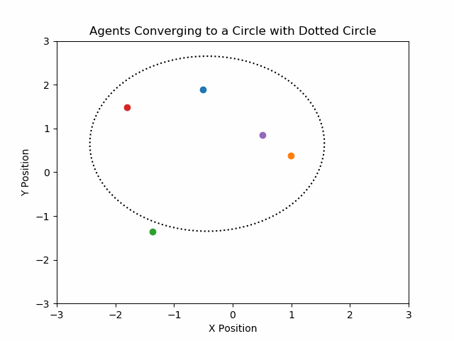

# A Review on Bearing-Based Control

This repository contains the simulation code for ECE6563: Networked Control final project

This is a sample simulation of 5 agents convergin to a pre-decided formation from a randomly initialized set of points without having ay knowledge of distances but only bearings. However, a scale is ambigous in such scenarios hence it is monitored to form a circle of desired radius

Bearing-only control:

